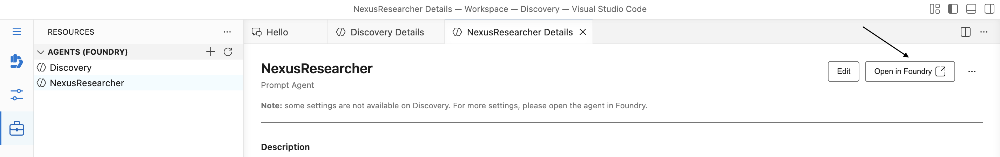
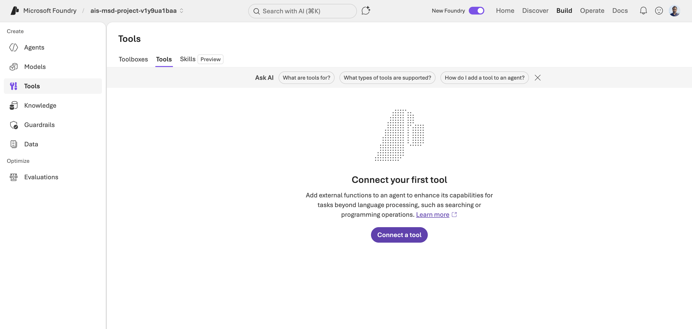
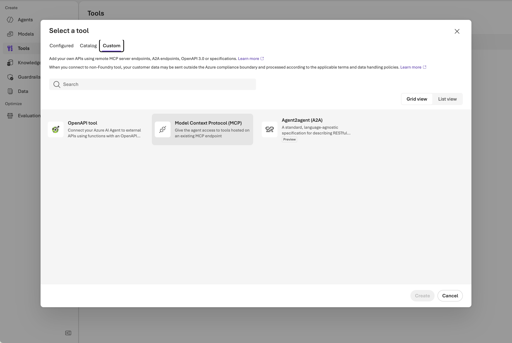
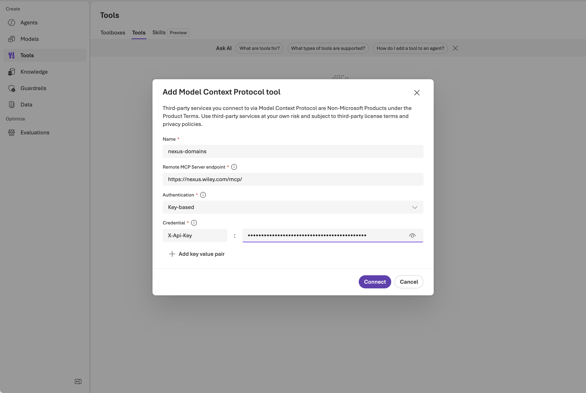
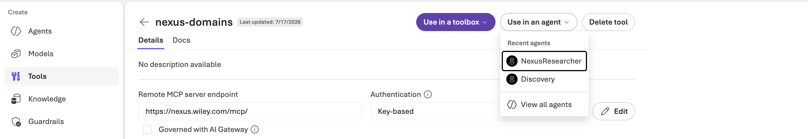
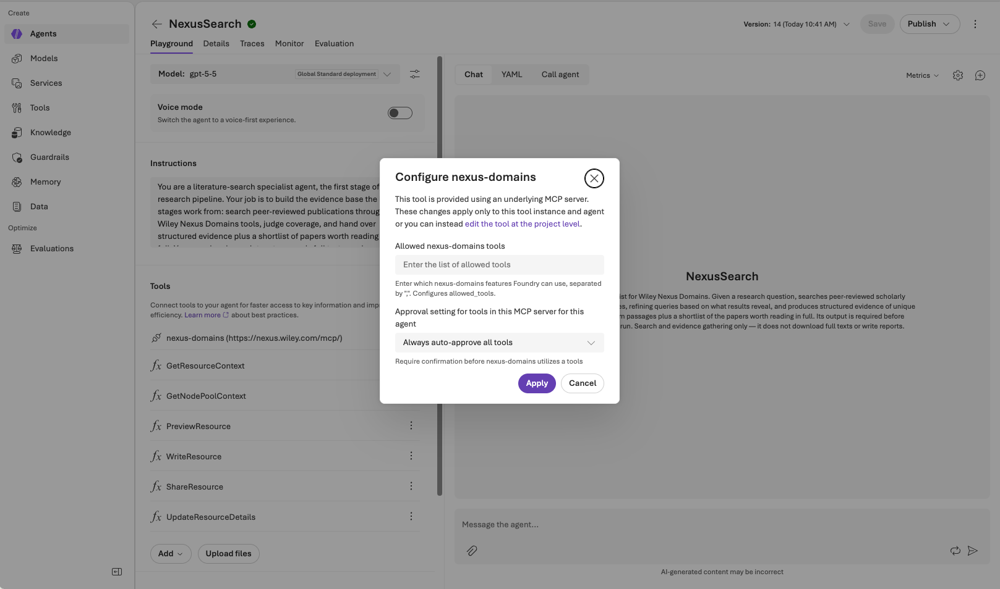

# Connecting the Wiley Nexus MCP tool

`NexusResearcher` — and the optional pipeline agents in [`../tasks/`](../tasks/README.md) — reach the
[Wiley Nexus](https://nexus.wiley.com/playground/docs/v1/getting-started/overview) corpus through an
**MCP tool**: a connection to a remote Model Context Protocol server, registered in the Microsoft
Foundry project that backs your Discovery workspace.

At the moment, Discovery Studio doesn't expose MCP tool registration, so this is done in Foundry. You
register the tool **once per project**, then attach it to each agent that needs it.

**Before you start:** create the agent in Discovery Studio and **save** it — the *Open in Foundry*
button only appears on a saved agent. You'll also need your Wiley Nexus API key.

---

## 1. Open the agent in Foundry

In Discovery Studio, open the agent under **Resources → Agents**, then select **Open in Foundry**.

> Studio itself notes that "some settings are not available on Discovery" — tools are one of them.

## 2. Go to Tools and start a new connection

In Foundry's left nav, select **Tools**, open the **Tools** tab, and select **Connect a tool**.

If the tool is already registered in this project, it appears here — skip to
[step 5](#5-attach-the-tool-to-your-agent).

## 3. Choose a custom MCP tool

In the **Select a tool** dialog, switch to the **Custom** tab and choose **Model Context Protocol
(MCP)**, then select **Create**.

## 4. Enter the Nexus connection details

| Field | Value |
| --- | --- |
| **Name** | `nexus-domains` |
| **Remote MCP Server endpoint** | `https://nexus.wiley.com/mcp/` |
| **Authentication** | `Key-based` |
| **Credential** | Key `X-Api-Key`, value = your Wiley Nexus API key |

Select **Connect**.

> **The API key lives only in this connection.** Never put it in an agent definition, a task
> description, or a source repository. The connection holds it, and agents use it without ever seeing
> it.

## 5. Attach the tool to your agent

Open the `nexus-domains` tool, then select **Use in an agent** and pick the agent from the list
(**View all agents** if it isn't under **Recent agents**).

Repeat this for each agent that needs Nexus access.

## 6. Configure the tool and set approval to auto-approve

This step is easy to miss and the agent will not work without it.

In the agent, find `nexus-domains` in the **Tools** list and open its configuration:

| Setting | What to enter |
| --- | --- |
| **Allowed nexus-domains tools** | Leave empty — the agent can then use every tool the server exposes. |
| **Approval setting for tools in this MCP server for this agent** | **`Always auto-approve all tools`** |

Select **Apply**.

> **Approval must be set to auto-approve.** The default asks for confirmation before every tool call,
> and in an autonomous task run there is nobody to confirm — the agent stalls waiting indefinitely.

## 7. Save the agent

Select **Save** (or **Publish** to promote the version for wider use). Each save creates a new immutable
version; the latest is what Discovery tasks use.

Back in Discovery Studio, the agent now lists `nexus-domains` among its tools, alongside the
resource-handling tools Discovery injects into every agent.

---

## The Nexus tools

The Wiley Nexus MCP server exposes two tools:

| Tool | What it does |
| --- | --- |
| `search_publications` | Semantic search over the Nexus corpus; returns passage-level hits with metadata and, when full text is available, a download token |
| `download_publication` | Returns one publication's full text, using a token from a search hit |

Two fields from the search response are referenced by the agent instructions: `full_text_token`, the
short-lived token that `download_publication` consumes, and `wol_link`, the publication's Wiley Online
Library URL used to build references.

For the full picture of the Wiley Nexus service — what the corpus covers, the tool parameters and
response shapes, token behavior, and rate limits — see the
**[Wiley Nexus documentation](https://nexus.wiley.com/playground/docs/v1/getting-started/overview)**.

How each agent actually uses these tools is governed by its instructions, not by the tool
configuration.

## Notes

- **Register once, attach many.** The tool is a project-level resource. Adding it to a second agent is
  just steps 5 and 6 — don't create a duplicate connection.
- **Per-agent settings vs. the tool itself.** Changes in the Configure dialog apply only to that one
  agent. To change the endpoint or credential for everyone, use the **edit the tool at the project
  level** link in that dialog.
- **Rotating the key.** Edit the credential on the project-level tool; agents pick it up without
  needing to be republished.
