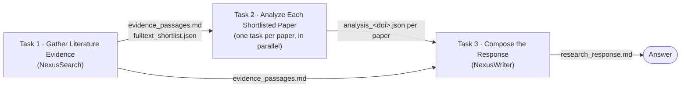

# Nexus Research — Discovery Engine pipeline

An optional three-agent pipeline that turns one research question into a grounded, citation-backed
answer, reading **each shortlisted paper in its own parallel task**.

This is an alternative to chatting with `NexusResearcher` directly (see
[`../README.md`](../README.md)). Use it when you want an autonomous, multi-paper review where every
paper gets a full read in an isolated context, instead of the two-paper cap of an interactive session.

## What it does

Three stages: search broadly, read the most relevant papers in full, then write the answer. The middle
stage is split into one task per paper.



You create **three** tasks. The Discovery Engine expands the middle one into as many per-paper tasks as
the shortlist contains.

### The three agents and their tasks

Each is a prompt agent you create in Discovery Studio. The files here are the paste source — YAML
frontmatter holds the form fields (name, displayName, description, model), and the body below the closing `---` is
the instructions.

| # | Task name | Agent | Definition | Produces |
| --- | --- | --- | --- | --- |
| 1 | `Gather Literature Evidence` | NexusSearch | [`nexus-search-agent.md`](nexus-search-agent.md) | The evidence base + a shortlist of papers worth reading in full |
| 2 | `Analyze Each Shortlisted Paper` | NexusFullTextAnalyzer (one instance per paper) | [`nexus-fulltext-analyzer-agent.md`](nexus-fulltext-analyzer-agent.md) | One analysis per shortlisted paper |
| 3 | `Compose the Response` | NexusWriter | [`nexus-writer-agent.md`](nexus-writer-agent.md) | The final answer |

### Outputs

| File | Written by | Contents |
| --- | --- | --- |
| `evidence_passages.md` | Task 1 | Every unique publication found, with its labeled metadata (DOI, authors, journal, full-text availability, Wiley Online Library link) and verbatim passages, plus a note on what each search angle covered. |
| `fulltext_shortlist.json` | Task 1 | The 3–5 papers most worth reading in full, each with its DOI, title, a one-line rationale, and its download token. |
| `analysis_<doi>.json` | Task 2, one per shortlisted paper | That paper's status, contribution, key findings, methods, and limitations — or a status of `unavailable` with a reason if it could not be retrieved. |
| `research_response.md` | Task 3 | **The deliverable** — a structured answer with IEEE-numbered citations linked to Wiley Online Library. |

## Before you start

- **The three agents exist in your project, with the Wiley Nexus MCP tool connected** — see
  [Creating the agents](#creating-the-agents) below.
- **A chat model deployment is available to the project** for the Discovery Engine's own planning and
  task validation, alongside the reasoning-model deployment the agents run on. Give it enough
  throughput to validate several per-paper tasks finishing at once.

---

## Creating the agents

Do this once per project, for each of the three definition files above.

1. In your project, go to **Resources → Agents → + Create new agent**.
2. Fill the form fields from the file's **YAML frontmatter**: `name` (the agent name tasks refer to),
   `displayName`, `description`, and the model.
   Substitute your own reasoning-model deployment name for `gpt-5-5`, and leave temperature and `top_p`
   unset — reasoning models reject them.
3. Paste everything **below the closing `---`** into **Instructions**.
4. Attach the `nexus-domains` MCP tool to **NexusSearch** and **NexusFullTextAnalyzer**, with approval
   set to auto-approve — see [`../mcp/README.md`](../mcp/README.md). **NexusWriter needs no Nexus
   tool**; it works only from the files the earlier stages produced.
5. **Save.** Each save creates a new immutable version, and tasks use the latest one.

Leave the descriptions as written. The Discovery Engine chooses an agent for each task by matching
against them, which is why the tasks below leave *Assigned to* blank.

---

## Creating and running the pipeline

### 1. Create a shared session

All three tasks must live in the **same session** — that's what lets them pass files to each other. Use
a **new session** for each research question.

1. Sidebar → **New shared session**. It opens as `Untitled`; there's no name field.
2. It takes its name from your first message, so send a short framing note rather than the research
   question:
   ```text
   Literature review workspace — <topic>. Tasks will be added to this session; no action needed yet.
   ```
3. Leave the agent picker on **`Discovery`** — picking NexusSearch here would run a real search in chat
   instead of as a task.

### 2. Create the three tasks

Transcribe the field values from [`nexus-research-task.md`](nexus-research-task.md), **in order
1 → 2 → 3**, with the Engine **stopped**. Creating them in order means each task's upstream dependency
already exists, so you can set *Dependent tasks* in the create form.

For each task, fill in:

| Field | What to enter |
| --- | --- |
| **Name** | From the task file |
| **Shared Session** | The session you just created |
| **Description** | Paste from the task file — replace `{{RESEARCH_QUESTION}}` with your question |
| **Validation Criteria** | Paste from the task file |
| **Assigned to** | **Leave blank on all three.** For Task 2 this is mandatory — a blank assignment is what lets the Engine split it into one task per paper. |
| **Priority** | `Medium` |
| **Dependent tasks** | Task 1: none · Task 2: Task 1 · Task 3: Tasks 1 and 2 |

*Parent* isn't on the create form and isn't needed here.

If *Dependent tasks* won't let you pick an upstream task, submit without it, then open the task →
**Linked tasks** → **Add dependent task** → select → **OK**.

### 3. Start the Discovery Engine

Open the session → **Tasks** tab → next to **Discovery Engine**, select **Start**.

The Engine stops itself once every task has finished. Stop it manually if you abandon a run.

### 4. Check the results

- **Tasks** tab — the status table and dependency graph; per-paper tasks appear under Task 2 as they
  are created.
- A task's **Artifacts** tab — the files it produced.
- `research_response.md` is the deliverable.

---

## Running it again for a new question

Tasks belong to the session they were created in, so each new question means a new session. The agents
are reusable — you only redo the tasks:

1. Create a new shared session.
2. Re-create the three tasks, changing only the `{{RESEARCH_QUESTION}}` line.
3. Start the Engine.

## Notes on the design

Three things about this pipeline are worth understanding before you change it:

- **Task 2 must stay unassigned.** The Engine decomposes an unassigned task; assigning an agent makes it
  run the whole shortlist as a single task instead of fanning out.
- **Task 1 lists the shortlist in its reply, not just in a file.** The Engine reads an upstream task's
  result text when planning what to create next, so that list is what it fans out over.
- **Output filenames use only letters, digits, dots, and underscores** — every other character in a
  DOI becomes an underscore — because the file-writing tool rejects hyphens and slashes.
